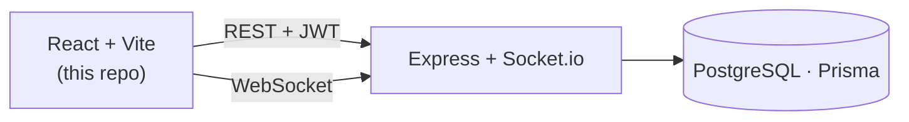

# What's the Plan — Frontend

Collaborative planning for groups: a shared calendar, to-do lists, polls, itineraries,
rich-text pages, and real-time chat. This is the **React (Vite) client**; the API and
WebSocket server live in the separate [`whats-the-plan-be`](https://github.com/abigayleh/whats-the-plan-be) repo.

## Features

- **Groups** — create or join named spaces (trips, households, teams); invite via code, with member/admin roles.
- **Calendar** — monthly / weekly / daily views, per-group color layers, recurring events, and to-dos with due dates.
- **Lists & to-dos** — group or personal lists, assignees, sub-to-dos, attachments, and drag-to-reorder.
- **Itineraries** — multi-day trips with a Plan / Notes / Polls hub and a day-view map (Leaflet).
- **Pages** — Notion-style rich-text docs (TipTap): nested pages, tables, images, page links, and slash commands.
- **Polls** — group polls with live results over WebSocket.
- **Chat** — DMs and group threads with anyone you share a group with.
- **Real-time** — calendar, lists, polls, chat, and pages update live via Socket.io.

## Tech stack

| | |
|---|---|
| Framework | React 19 + Vite |
| Routing | React Router |
| Styling | SASS (SCSS), 7-1 structure |
| Real-time | socket.io-client |
| Rich text | TipTap |
| Maps | Leaflet + react-leaflet |
| Drag & drop | dnd-kit |
| Lint | oxlint |

Auth is JWT (access + refresh tokens); the client talks to the backend over REST + Socket.io.

## Technical highlights

- **Real-time sync** — mutations broadcast over Socket.io rooms (`user:`, `group:`, `conversation:`); clients reconcile live, with no polling.
- **Optimistic updates with rollback** — writes hit the shared cache immediately and revert on failure. Server facts live in one place and aren't mirrored into component state, so views can't drift.
- **JWT auth with silent refresh** — access + refresh tokens; a `401` transparently refreshes and retries the original request.
- **Custom rich-text editor** — TipTap extended with bespoke nodes: page-to-page links, a `/` slash-command menu, an `@`-mention picker, tables, and image embeds.
- **Recurring events expanded on read** — recurrence rules are stored once and occurrences generated per query window, not pre-materialized.
- **Timezone-correct dates** — calendar/date-only fields are handled as true calendar days to avoid UTC drift.
- **Transactional drag-and-drop** — dnd-kit on the client; a single DB transaction on the server keeps sibling order consistent.

## Architecture



## Getting started

**Prerequisites:** Node 18+, and the [backend](https://github.com/abigayleh/whats-the-plan-be) running (defaults to `http://localhost:4000`).

```bash
npm install
cp .env.example .env    # set VITE_API_URL if the backend isn't on http://localhost:4000
npm run dev             # start the dev server (http://localhost:5173)
```

## Scripts

| Command | Does |
|---|---|
| `npm run dev` | Start the Vite dev server with HMR |
| `npm run build` | Production build to `dist/` |
| `npm run preview` | Serve the production build locally |
| `npm run lint` | Lint with oxlint |

## Environment

Only one variable, and it is **public** (compiled into the browser bundle — never put a secret behind the `VITE_` prefix):

| Variable | Purpose |
|---|---|
| `VITE_API_URL` | Base URL of the backend REST + Socket.io server (default `http://localhost:4000`) |

## Project structure

```
src/
  api/         REST + token client, one module per resource
  components/  UI by domain (calendar, lists, itineraries, pages, chat, groups, …)
  hooks/       shared logic (useAppData, useSocket, useItineraries, …)
  pages/       top-level routed screens
  socket/      Socket.io client + event handlers
  store/       app-wide providers (auth, app data)
  styles/      SCSS (abstracts / base / components / layout / pages)
```

State follows a single-source-of-truth model: components read server data from shared hooks
and mutations update that cache — server facts aren't mirrored into local component state.

## License

[MIT](LICENSE) © Abigayle Hickey